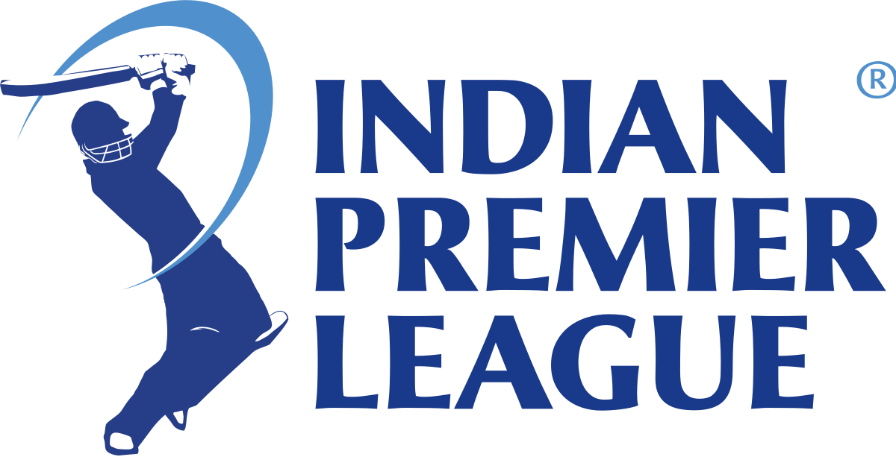

# IPL Match Win Predictor

## Table of Content
* [Overview](#overview)
* [Motivation](#motivation)
* [Problem Solving Steps](#problem-solving-steps)
* [Source of Dataset](#source-of-dataset)
* [Data Cleaning Techniques](#data-cleaning-techniques)
* [Exploratory Data Analysis](#exploratory-data-analysis)
* [Model Building and Performance](#model-building-and-performance)
* [Deployment](#deployment)

## Overview

Indian Premier League (IPL) is a Twenty20 cricket format league in India. It is usually played in April and May every year. As of 2019, the title sponsor of the game is Vivo. The league was founded by Board of Control for Cricket India (BCCI) in 2008

Based on the first innings performance of a team, this app takes in current data of second innings and predicts the win probability of the two teams.   

## Motivation

## Problem Solving Steps

1. Load the Dataset into a pandas Data frame
2. Perform Exploratory Data Analysis on the data
3. Feature Engineering: Extract new features
4. Fit a Machine Learning Pipeline on the extracted data
5. Integrate the Pipeline with the User Interface which is created using Streamlit
6. Deploy the model on a cloud service

## Source of Dataset

The dataset consist of data about IPL matches played from the year 2008 to 2019. The sources of the data sets are from;
* Data source from 2008-2017 - [CricSheet.org and Manas - Kaggle](https://cricsheet.org/)
* Data source for 2018-2019 - [IPL T20 - Official website](https://www.iplt20.com/)

## Data Cleaning Techniques

- For the teams, only the most frequent participating teams were uesed for the analysis, while old team names were replaced with theire respective curreent names.
- Match entries that were interrupted were dropped
- The two data sets were merged on the `match_id` column to enhace data analysis.
- New features like `current_score`, `runs_left`, `balls_left`, `players_dismmised` etc were created to improve the model performance.

## Exploratory Data Analysis

The following steps were taken for the data analysis;
- The total runs for the first innings in the data set was extracted
- The two dataframe were merged
- We got the `current_score` by a cumulative sum of the total runs for the second innings.
- We created a `result` column to identify the winners.

## Model Building and Performance

Only Important columns in the data set was used to build the model. This columns were selected based on domain knowledge and expertise in the subject matter.

To models were trained Logistic Regression and RandomForest Classifier.
Although the RansomForestClassifier model had a better accuracy (0.9992991800406475)
than th Logistic Regression model (accuracy = 0.8063634452309202), we decided to go with the Logistic Regression for this project. This is because the Logistic Regression performed better for the task on the prediction probability. For example f Logistic regression prediction probability or a given sample was [0.54477506, 0.45522494], this means 54% and 45% win probability for each team. While the Random Forest prediction probability for the same sample was [0.05, 0.95] that is 5% chance for one team and 95% chance for the other team. 

Therefore it is better to use a model which gives "Equal Justice" towards both sides as we do not know which team will out perform and win the game in the second inning!

## Deployment

The model was deployed on Streamit Cloud

